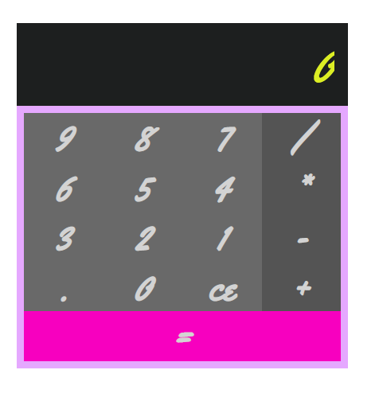
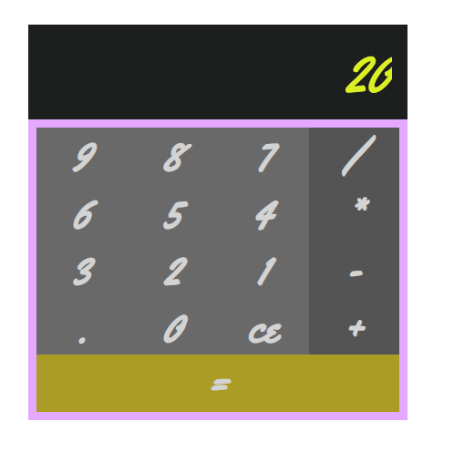
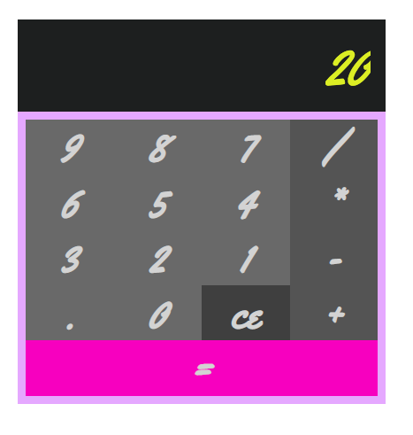
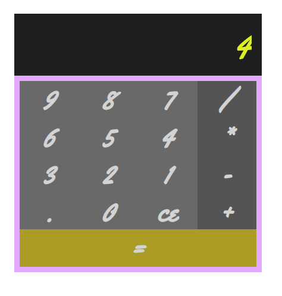

# Calculator

This calculator works exactly how you would expect a simple calculator to work: it can perform addition, subtraction, multiplication and division. Pressing the 'ce' button deletes a value.

**Calculator** is deployed with **Surge** at: [this link](http://limping-blade.surge.sh/)!

# How to run

* Clone the repo: 
```html
git clone https://github.com/emilyjspencer/tdd-react-2.git
```

* Cd into the repo
* Run the following to install the dependencies:
```html
npm install
```
* Run the following to open the calculator in the browser:
```html
npm start
```

# Built with:
* React
* CSS

# Tested with:
* Enzyme
* Jest

# What it looks like:






### Deployed with Surge at: [this link](http://limping-blade.surge.sh/)!